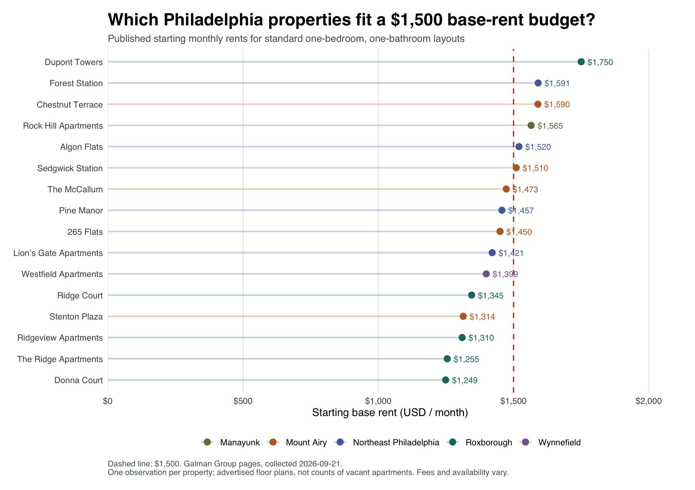
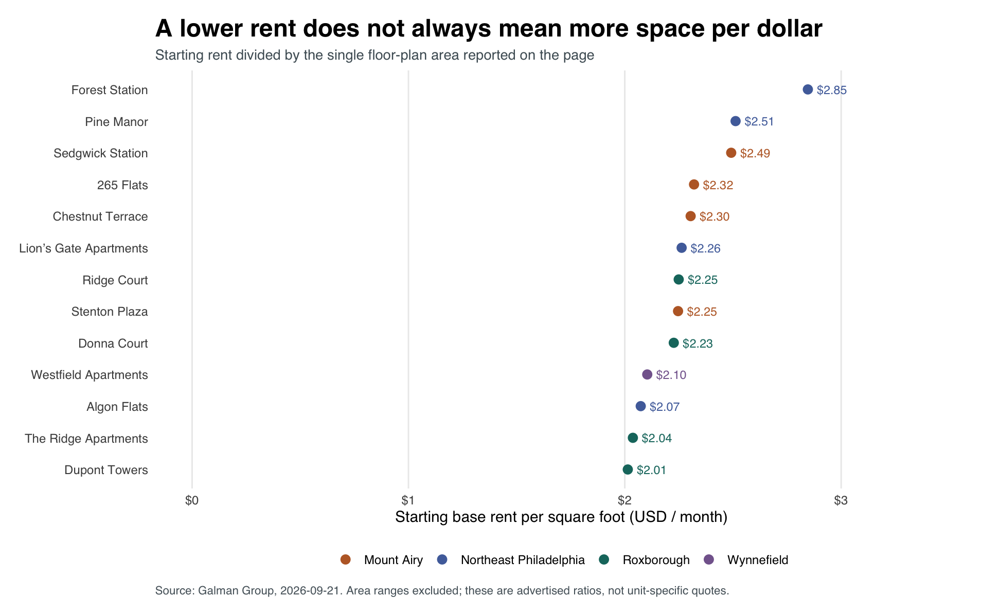

*A comparison of advertised one-bedroom floor plans from one property manager, collected September 21, 2026.*

## The question

For someone searching for a Philadelphia apartment, a monthly budget is only the beginning. Two apartments with similar rents can offer very different amounts of space. This project asks: **Within a sample of Galman Group properties, where should a renter with a \$1,500 monthly base-rent budget start looking for a standard one-bedroom apartment?** I compare advertised starting rents and space per dollar to build a practical shortlist.

## Data and methods

I collected data from the [Galman Group’s Philadelphia directory](https://galmangroup.com/philadelphia/) and its linked property pages using R’s `rvest` package. The directory provided 21 Philadelphia property links; I excluded an unrelated promotional link for Jenkintown. I checked the published `robots.txt`, used sequential requests with two-second pauses, and accessed only public pages. `read_html()` retrieved the HTML, and `html_table()` extracted 59 floor-plan records. The project includes source URLs, collection timestamps, factual HTML table extracts, and code so the saved analysis can be reproduced without repeatedly requesting the website.

To make the comparison more consistent, I retained ordinary one-bedroom, one-bathroom layouts. I excluded 34 records with other bedroom counts, five junior, den, or bi-level layouts, and four remaining records without a numerical rent. The resulting sample contains **16 floor plans at 16 properties**. Missing prices remain missing rather than becoming zero. I grouped properties using the locations named in their page headings; Northeast Philadelphia combines several neighborhoods. Each property receives equal weight, regardless of its number of apartments. The figures represent starting prices for advertised layouts, not confirmed vacancies or signed leases.

## Which areas fit the budget?



Among the three areas with at least four comparable properties, **Roxborough had the lowest median starting rent: \$1,310**. Its median was \$163 below Mount Airy’s \$1,473 and \$178.50 below Northeast Philadelphia’s \$1,488.50. Four of five Roxborough properties met the \$1,500 base-rent threshold, compared with three of five in Mount Airy and two of four in Northeast Philadelphia. These fractions describe the sampled properties with published prices; they do not measure the share of all local apartments available within budget. Wynnefield and Manayunk each contributed only one observation, making broader comparisons especially uncertain.

| Area | Properties with published rent | Median starting rent/month | At or below \$1,500 |
|---|---:|---:|---:|
| Roxborough | 5 | \$1,310.00 | 4 of 5 (80%) |
| Wynnefield | 1 | \$1,399.00 | 1 of 1 (100%) |
| Mount Airy | 5 | \$1,473.00 | 3 of 5 (60%) |
| Northeast Philadelphia | 4 | \$1,488.50 | 2 of 4 (50%) |
| Manayunk | 1 | \$1,565.00 | 0 of 1 (0%) |

## Comparing space per dollar

Floor-plan size changes the interpretation. [Donna Court](https://galmangroup.com/property/donna-court/) had the lowest starting rent, \$1,249 for 561 square feet. [The Ridge Apartments](https://galmangroup.com/property/the-ridge-apartments/) advertised \$1,255 for 616 square feet: 55 additional square feet for just \$6 more per month. Their advertised rent-to-area ratios were approximately \$2.23 and \$2.04 per square foot, respectively. For renters prioritizing space within budget, The Ridge therefore warrants an early inquiry. I calculated this ratio for 13 properties with a single stated area; three area ranges were excluded because their starting rents could not be matched to an exact size.



Space efficiency alone can also mislead. [Dupont Towers](https://galmangroup.com/property/dupont-towers/) had the lowest calculated ratio, about \$2.01 per square foot, but its \$1,750 starting rent exceeded the budget. A useful search strategy therefore applies the budget constraint first, then compares space among the remaining options.

## Limitations and takeaway

This is a small, nonrandom sample from one manager, with uneven geographic coverage. Building quality, utilities, fees, concessions, lease dates, and commuting costs are not standardized. Prices can change, and a posted starting price does not establish that a matching apartment is currently available. These limitations prevent a claim that Roxborough is Philadelphia’s cheapest neighborhood. The actionable takeaway is narrower: **start by checking The Ridge and Donna Court in Roxborough, then request a quote for a specific available unit and compare total monthly costs before arranging tours.**

## Data sources and reproducible code

All property URLs and collection timestamps are documented in [the source list](data/sources.csv). The [comparison dataset](data/one_bedroom_comparison.csv) contains the 16 eligible floor plans, and [the exclusion audit](data/exclusions.csv) records the cleaning decisions. See [the project instructions](README.md) for how to reproduce the analysis from the saved HTML extracts.

The code below is displayed for reproducibility. Rendering this post uses the saved figures and does not request the apartment website again. From this post's folder, run `source("run.R")` in R to rebuild the analysis.

<details>
<summary>Package setup</summary>

```r
# Install into this project rather than modifying a system R library.
dir.create('.R-library',showWarnings=FALSE)
.libPaths(c(normalizePath('.R-library'),.libPaths()))
packages <- c('rvest','dplyr','readr','stringr','ggplot2','httr','commonmark','jsonlite')
missing <- packages[!vapply(packages,requireNamespace,logical(1),quietly=TRUE)]
if(length(missing)) install.packages(missing,repos='https://cloud.r-project.org',lib='.R-library')
```

</details>

<details>
<summary>Collect and extract the rental data</summary>

```r
# Run from the project root. Default: reproduce from saved factual HTML extracts.
# Rscript R/01_scrape.R --live requests a new snapshot from the public website.
suppressPackageStartupMessages({
  library(rvest); library(dplyr); library(readr); library(stringr)
})
dir.create('data', showWarnings = FALSE)
dir.create('data/snapshots', showWarnings = FALSE)
base_url <- 'https://galmangroup.com'
index_url <- paste0(base_url, '/philadelphia/')
live <- '--live' %in% commandArgs(trailingOnly = TRUE)

fetch_html <- function(url) {
  Sys.sleep(2) # Sequential requests; never bypass login, CAPTCHA or rate limits.
  response <- httr::GET(url, httr::timeout(45),
    httr::user_agent('PhillyRentClassProject/1.0 (educational research; limited requests)'))
  httr::stop_for_status(response) # Stop on errors, including 403 and 429.
  rvest::read_html(httr::content(response, as = 'raw'))
}

# Preserve only factual table cells, a property name and its location heading.
# No images, tracking scripts, contact forms or full marketing descriptions.
make_extract <- function(doc, path) {
  tables <- html_elements(doc, 'table')
  keep <- vapply(html_table(tables, convert = FALSE), function(x)
    all(c('Model', 'Beds', 'Baths', 'Rent', 'Sq Ft') %in% names(x)), logical(1))
  if (sum(keep) != 1) stop('Expected exactly one rental table: ', path)
  table <- tables[[which(keep)]]
  xml2::xml_remove(html_elements(table, 'img,script,style,a'))
  html <- paste0('<!doctype html><html><head><meta charset="utf-8"></head><body>',
    as.character(html_element(doc, 'h1')), as.character(html_element(doc, 'h2')),
    as.character(table), '</body></html>')
  writeLines(html, path, useBytes = TRUE)
}

if (live) {
  # The stored robots file was manually reviewed on the original collection date.
  # If it changes, stop for a fresh review rather than assuming continuing access.
  response <- httr::GET(paste0(base_url, '/robots.txt'), httr::timeout(45))
  httr::stop_for_status(response)
  current <- str_trim(httr::content(response, as = 'text', encoding = 'UTF-8'))
  reviewed <- str_trim(paste(readLines('data/robots-reviewed.txt', warn = FALSE), collapse='\n'))
  if (!identical(current, reviewed)) stop('robots.txt changed. Review current site rules before collecting again.')
  index <- fetch_html(index_url)
  urls <- unique(html_attr(html_elements(index, 'a'), 'href'))
  urls <- urls[!is.na(urls) & str_detect(urls, '^https://galmangroup.com/property/') &
                 !str_detect(urls, '/the-flats-at-jenkintown/')]
  if (!length(urls)) stop('No property links found: inspect the directory layout.')
  # Includes property links present in the static directory, including Westfield.
  # The promotional Jenkintown banner is outside Philadelphia and is excluded.
  manifest <- list()
  for (i in seq_along(urls)) {
    url <- urls[i]
    slug <- str_remove(str_remove(url, fixed(paste0(base_url, '/property/'))), '/$')
    doc <- fetch_html(url)
    file <- paste0('data/snapshots/', slug, '.html')
    make_extract(doc, file)
    manifest[[i]] <- tibble(slug = slug, url = url, snapshot_file = file,
      retrieved_at_utc = format(Sys.time(), '%Y-%m-%dT%H:%M:%SZ', tz='UTC'))
  }
  write_csv(bind_rows(manifest), 'data/sources.csv')
}

manifest <- read_csv('data/sources.csv', show_col_types = FALSE)
rows <- vector('list', nrow(manifest))
for (i in seq_len(nrow(manifest))) {
  doc <- read_html(manifest$snapshot_file[i])
  tab <- html_table(doc, convert = FALSE)[[1]]
  required <- c('Model','Beds','Baths','Rent','Sq Ft')
  if (!all(required %in% names(tab))) stop('Rental table schema changed.')
  rows[[i]] <- tibble(
    slug = manifest$slug[i], property = html_text2(html_element(doc,'h1')),
    location_heading = html_text2(html_element(doc,'h2')),
    model_raw = str_squish(tab$Model), beds_raw = str_squish(tab$Beds),
    baths_raw = str_squish(tab$Baths), rent_raw = str_squish(tab$Rent),
    sqft_raw = str_squish(tab[['Sq Ft']]), source_url = manifest$url[i],
    retrieved_at_utc = manifest$retrieved_at_utc[i])
}
raw <- bind_rows(rows)
if (anyDuplicated(raw[c('slug','model_raw','beds_raw','baths_raw')])) stop('Duplicate property/model rows require review.')
write_csv(raw, 'data/floorplans_raw.csv')
message('Parsed ', nrow(raw), ' floor-plan rows from ', nrow(manifest), ' property pages.')
```

</details>

<details>
<summary>Clean, compare, and plot</summary>

```r
suppressPackageStartupMessages({
  library(dplyr); library(readr); library(stringr); library(ggplot2)
})
budget <- 1500 # Illustrative monthly BASE-rent budget, not an all-in-cost ceiling.
dir.create('figures', showWarnings=FALSE)
raw <- read_csv('data/floorplans_raw.csv', show_col_types=FALSE)

# Do not coerce 'Call for Availability' to zero, or average an area range.
get_numbers <- function(x) str_extract_all(str_remove_all(x, ','), '[0-9]+(?:\\.[0-9]+)?')
rent_numbers <- get_numbers(raw$rent_raw)
size_numbers <- get_numbers(raw$sqft_raw)
first_number <- function(x) if(length(x)) as.numeric(x[1]) else NA_real_
last_number <- function(x) if(length(x)) as.numeric(tail(x,1)) else NA_real_
clean <- raw %>% mutate(
  beds = if_else(str_detect(str_to_lower(beds_raw), 'studio'), 0, suppressWarnings(as.numeric(beds_raw))),
  baths = suppressWarnings(as.numeric(baths_raw)),
  rent_start = vapply(rent_numbers, first_number, numeric(1)),
  sqft_min = vapply(size_numbers, first_number, numeric(1)),
  sqft_max = vapply(size_numbers, last_number, numeric(1)),
  exact_area = lengths(size_numbers) == 1L,
  special_layout = str_detect(str_to_lower(model_raw), 'jr|junior|den|bi.level|town'),
  area = case_when(
    str_detect(location_heading, regex('Roxborough',ignore_case=TRUE)) ~ 'Roxborough',
    str_detect(location_heading, regex('Manayunk',ignore_case=TRUE)) ~ 'Manayunk',
    str_detect(location_heading, regex('Mt\\.?\\s*Airy|Mount Airy',ignore_case=TRUE)) ~ 'Mount Airy',
    str_detect(location_heading, regex('Wynnefield',ignore_case=TRUE)) ~ 'Wynnefield',
    str_detect(location_heading, regex('Fox Chase|Somerton|Bustleton|Rhawnhurst|Northeast',ignore_case=TRUE)) ~ 'Northeast Philadelphia',
    TRUE ~ NA_character_),
  eligible_standard_1br = beds == 1 & baths == 1 & !special_layout,
  exclusion_reason = case_when(
    beds != 1 ~ 'Not one bedroom',
    baths != 1 ~ 'Not one bathroom',
    special_layout ~ 'Junior, den, bi-level or townhouse layout',
    is.na(rent_start) ~ 'No published numerical rent',
    TRUE ~ 'Included'),
  monthly_rent_per_sqft = if_else(exact_area & !is.na(rent_start), rent_start/sqft_min, NA_real_),
  within_base_budget = !is.na(rent_start) & rent_start <= budget)
if(anyNA(clean$area)) stop('Unmapped location headings: ', paste(unique(clean$location_heading[is.na(clean$area)]),collapse='; '))
if(any(clean$rent_start <= 0,na.rm=TRUE) || any(clean$sqft_min <= 0,na.rm=TRUE)) stop('Nonpositive rent or size: inspect data.')
if(any(clean$sqft_min > clean$sqft_max,na.rm=TRUE)) stop('Area range is reversed.')
write_csv(clean,'data/floorplans_clean.csv')
one <- filter(clean, eligible_standard_1br, !is.na(rent_start))
if(anyDuplicated(one$slug)) stop('Multiple standard one-bedroom models at one property: review weighting before comparing areas.')
write_csv(one,'data/one_bedroom_comparison.csv')
summary <- one %>% group_by(area) %>% summarise(
  properties_with_published_rent=n(), median_starting_rent=median(rent_start),
  minimum_starting_rent=min(rent_start), maximum_starting_rent=max(rent_start),
  properties_at_or_below_budget=sum(within_base_budget),
  share_at_or_below_budget=mean(within_base_budget), .groups='drop') %>% arrange(median_starting_rent)
write_csv(summary,'data/area_summary.csv')
audit <- clean %>% count(exclusion_reason,name='floorplan_rows')
write_csv(audit,'data/exclusions.csv')

colors <- c('Roxborough'='#16766d','Mount Airy'='#bc682f','Northeast Philadelphia'='#516eaa','Wynnefield'='#84669c','Manayunk'='#747b45')
base_theme <- theme_minimal(base_size=12,base_family='sans') + theme(
  plot.title=element_text(face='bold',size=19), plot.subtitle=element_text(size=11,color='#4e5c64'),
  panel.grid.minor=element_blank(), panel.grid.major.y=element_blank(),
  plot.caption=element_text(hjust=0,size=9,color='#57636a'), legend.position='bottom',
  plot.margin=margin(15,25,15,15),plot.background=element_rect(fill='white',color=NA))
plot_data <- one %>% arrange(rent_start) %>% mutate(property=factor(property,levels=property))
p1 <- ggplot(plot_data,aes(rent_start,property,color=area)) +
  geom_vline(xintercept=budget,linetype='dashed',color='#b8493c',linewidth=.7) +
  geom_segment(aes(x=0,xend=rent_start,yend=property),linewidth=.8,alpha=.3) +
  geom_point(size=3) + geom_text(aes(label=scales::dollar(rent_start,accuracy=1)),hjust=-.25,size=3.3,show.legend=FALSE) +
  scale_color_manual(values=colors) + scale_x_continuous(labels=scales::label_dollar(),limits=c(0,max(one$rent_start)*1.17),expand=expansion(mult=c(0,.02))) +
  labs(title='Which Philadelphia properties fit a $1,500 base-rent budget?',
    subtitle='Published starting monthly rents for standard one-bedroom, one-bathroom layouts',
    x='Starting base rent (USD / month)',y=NULL,color=NULL,
    caption='Dashed line: $1,500. Galman Group pages, collected September 21, 2026.\nOne observation per property; advertised floor plans, not counts of vacant apartments. Fees and availability vary.') + base_theme
# The dates below follow the collected snapshot and change automatically on a refresh.
collection_date <- substr(min(one$retrieved_at_utc),1,10)
p1 <- p1 + labs(caption=paste0('Dashed line: $1,500. Galman Group pages, collected ',collection_date,'.\nOne observation per property; advertised floor plans, not counts of vacant apartments. Fees and availability vary.'))
ggsave('figures/starting_rents.png',p1,width=10.8,height=max(6.5,.32*nrow(one)+2.5),dpi=180,bg='white')

exact <- one %>% filter(exact_area) %>% arrange(monthly_rent_per_sqft) %>% mutate(property=factor(property,levels=property))
p2 <- ggplot(exact,aes(monthly_rent_per_sqft,property,color=area)) +
  geom_point(size=3) + geom_text(aes(label=sprintf('$%.2f',monthly_rent_per_sqft)),hjust=-.3,size=3.3,show.legend=FALSE) +
  scale_color_manual(values=colors) + scale_x_continuous(labels=scales::label_dollar(),limits=c(0,max(exact$monthly_rent_per_sqft)*1.2)) +
  labs(title='A lower rent does not always mean more space per dollar',
    subtitle='Starting rent divided by the single floor-plan area reported on the page',
    x='Starting base rent per square foot (USD / month)',y=NULL,color=NULL,
    caption=paste0('Source: Galman Group, ',collection_date,'. Area ranges excluded; these are advertised ratios, not unit-specific quotes.')) + base_theme
ggsave('figures/rent_per_sqft.png',p2,width=10.8,height=max(6.5,.32*nrow(exact)+2.5),dpi=180,bg='white')
writeLines(capture.output(sessionInfo()),'data/sessionInfo.txt')
print(summary)
print(select(one,property,area,rent_start,sqft_raw,monthly_rent_per_sqft),n=40)
```

</details>

<details>
<summary>Run the analysis</summary>

```r
# Run with the working directory set to this post2 folder.
source("setup.R")
source("R/01_scrape.R")
source("R/02_analyze.R")
message("Analysis rebuilt. Open index.qmd and click Render to build the Quarto post.")
```

</details>

