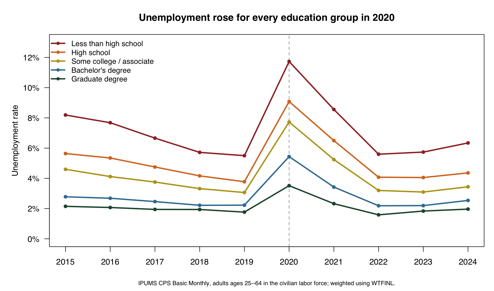
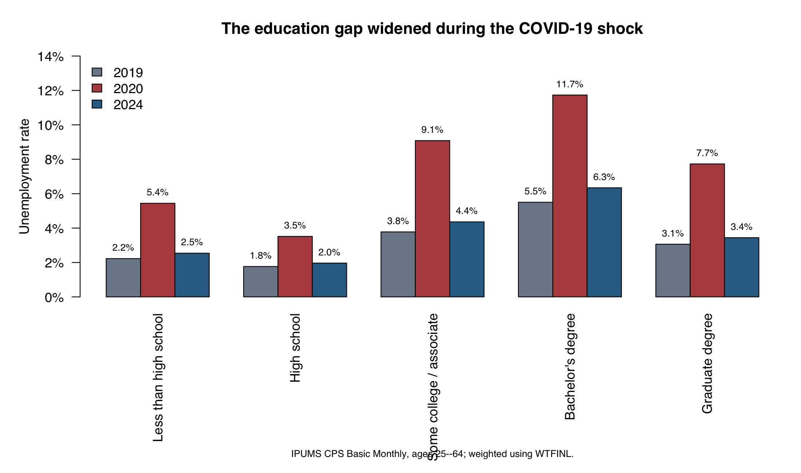
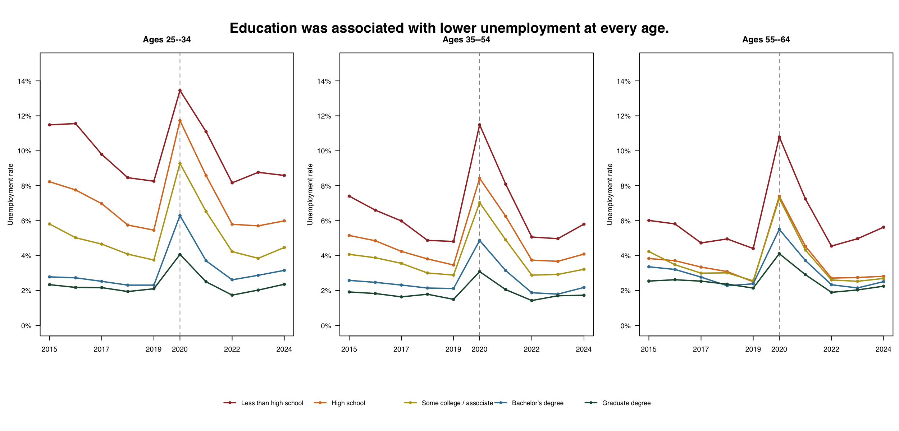

*How unemployment differed by education before, during, and after the COVID-19 labor-market shock. Estimates use IPUMS CPS Basic Monthly data from 2015--2024 and the CPS final person weight.*

## The question

The COVID-19 recession disrupted the U.S. labor market quickly, but its consequences were not distributed evenly. Workers with different educational backgrounds are concentrated in different occupations and industries, and those differences can shape exposure to job loss. This post asks: **How did unemployment vary by educational attainment before, during, and after the COVID-19 shock?**

I focus on adults ages 25--64 who were in the civilian labor force. This keeps the comparison centered on people who were employed or actively seeking work, rather than on full-time students or most retirees. The goal is descriptive: to show how unemployment patterns differed across education groups, not to estimate the causal effect of education itself.

## Data and methods

I use [IPUMS Current Population Survey (CPS)](https://cps.ipums.org/) **Basic Monthly** samples from 2015 through 2024. The extract includes all twelve monthly samples in each year and the variables needed to identify age, employment status, educational attainment, and person weights.

The outcome is the unemployment rate:

$$
\text{Unemployment rate} =
\frac{\text{weighted number unemployed}}
{\text{weighted civilian labor force}}.
$$

I classify respondents into five education groups: less than high school, high school, some college or an associate degree, a bachelor's degree, and a graduate degree. Every estimate uses `WTFINL`, IPUMS CPS's final person-level weight for Basic Monthly data. This step is essential: it makes the estimates describe the U.S. population represented by the CPS rather than the raw respondents in the downloaded file.

The yearly values pool monthly interviews within each calendar year. They should therefore be read as weighted annual averages of monthly labor-market conditions.

## The pandemic widened an existing education gap

Before the pandemic, unemployment already followed a clear education gradient. In 2019, adults without a high-school credential had an unemployment rate of **5.5%**, compared with **1.8%** among adults with graduate degrees. The gap was visible throughout the pre-2020 period.

{fig-alt="Line chart of weighted unemployment rates by education from 2015 to 2024, with a sharp rise in 2020 for all education groups." fig-cap="Weighted annual unemployment rates by educational attainment, adults ages 25--64 in the civilian labor force."}

The COVID-19 shock magnified that difference. In 2020, unemployment rose to **11.7%** among people without a high-school credential. For graduate-degree holders, it rose to **3.5%**. Every group experienced a substantial increase, but the increase was largest among workers with less education.

{fig-alt="Grouped bar chart comparing unemployment in 2019, 2020, and 2024 across five education groups." fig-cap="The education gap widened during the COVID-19 shock."}

## Recovery reduced, but did not eliminate, the gap

By 2024, unemployment had fallen sharply across all five groups. Yet the ordering remained unchanged. The rate was **6.3%** for adults with less than a high-school education and **2.0%** for adults with graduate degrees. The difference was much smaller than in 2020 but still economically meaningful.

This result does not mean education alone determined who lost work. Educational attainment is connected to occupation, industry, work experience, location, and many other factors. Still, it is a useful summary measure of unequal labor-market risk.

## Age patterns

The education gradient appeared at every stage of working life. Adults ages 25--34 generally had the highest unemployment rates, especially during 2020. However, less-educated workers also faced higher unemployment among prime-age adults (35--54) and older working-age adults (55--64).

{fig-alt="Three line charts showing unemployment by education for ages 25--34, 35--54, and 55--64." fig-cap="Education was associated with lower unemployment across all three age groups."}

For example, in 2020, unemployment among adults without a high-school credential exceeded 10% in each age group. The corresponding rate for graduate-degree holders was roughly 3% to 4%. Thus, age changed the overall level of unemployment, but it did not remove the education gradient.

## Limitations and takeaway

This analysis is descriptive. It does not control for occupation, industry, race and ethnicity, geography, or other characteristics that may also influence unemployment. It also pools monthly CPS observations into annual estimates, so it summarizes average labor-market conditions rather than tracking the same workers over time.

The main takeaway is clear: education did not make workers immune to the COVID-19 recession, but it was strongly associated with lower unemployment before, during, and after the shock. The pandemic amplified a pre-existing gap, and the recovery narrowed that gap without eliminating it.

## Data sources and reproducible code

Data source: [IPUMS CPS Basic Monthly](https://cps.ipums.org/), 2015--2024. The analysis uses the `WTFINL` final Basic Monthly person weight, documented by IPUMS [here](https://cps.ipums.org/cps-action/variables/WTFINL). The accompanying R scripts import the CPS CSV, create the weighted summary tables, and generate all three figures.

