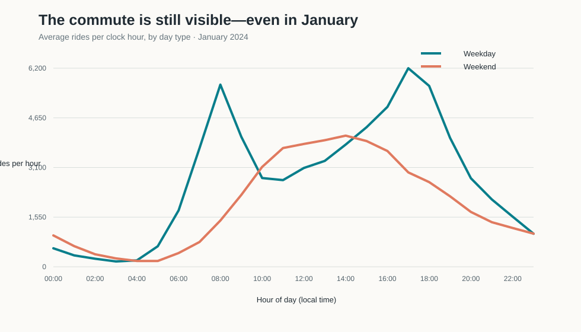
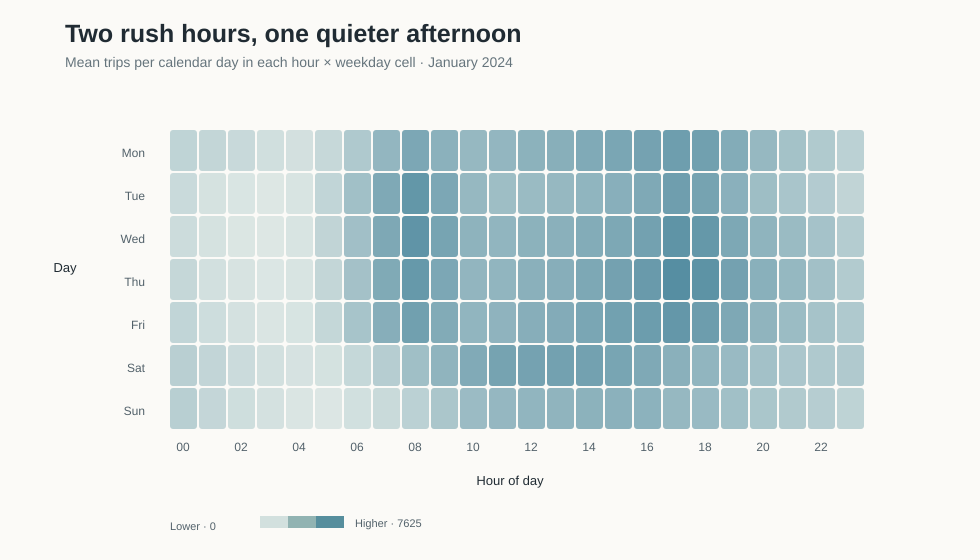
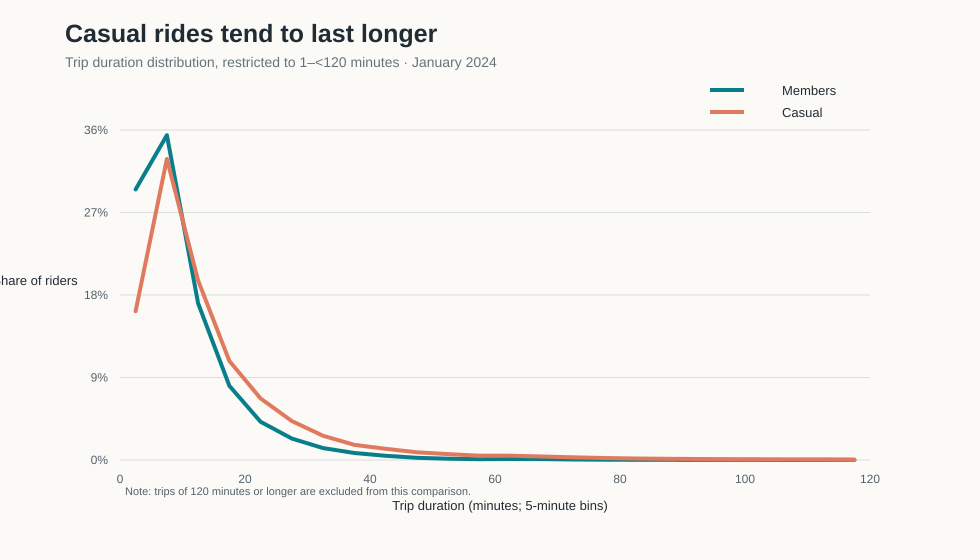

```{r}
#| label: prepare-data-and-figures
#| include: false
project_dir <- dirname(knitr::current_input(dir = TRUE))
source(file.path(project_dir, "blogpost4_citibike.R"), local = knitr::knit_global())
source(file.path(project_dir, "make_figures.R"), local = knitr::knit_global())
```

*How do New Yorkers use Citi Bike in the middle of winter? A look at every published January 2024 trip suggests two daily rhythms: a weekday rush-hour pulse and a later weekend peak. Annual members also tend to take shorter rides than casual riders.*

## The question

A bike-share system can be a quick link in a commute or the start of a leisurely weekend ride. **Do January Citi Bike trips look more like weekday transportation or weekend recreation, and do members and casual riders use the system in the same way?**

I examine all published Citi Bike trip records that began in January 2024. The goal is descriptive: compare when trips start and how long they last. The data do not record why an individual rides, so “commute-shaped” and “recreation-shaped” describe timing patterns, not the purpose of any specific trip.

## Data and methods

I use Citi Bike’s [official trip-history archive](https://citibikenyc.com/system-data). The R script downloads the January 2024 ZIP from the published archive when it is not already in `data/raw/`, then reads every CSV inside it. The source says published records exclude staff/test trips and trips under 60 seconds. Months with more than one million rides can be split across CSV files, so I process every January file.

Trip starts are counted by the local timestamp in `started_at`. Monday through Friday are weekdays; Saturday and Sunday are weekends. Hourly figures are averaged over the number of calendar days in each group, making the 23 weekdays and 8 weekend days comparable. For trip length, I compare trips from 1 minute to less than 120 minutes using five-minute bins.

The archive yielded **`r fmt_n(nrow(trips_valid))` valid January rides**. I omitted **`r fmt_n(rows_omitted)` rows** with invalid timestamps, nonpositive durations, out-of-month starts, or an unrecognized rider category. Citi Bike itself removes trips shorter than 60 seconds before publishing the files.

## The weekday commute pulse

{fig-alt="A two-line chart shows weekday ride starts peaking around 8 a.m. and 5 p.m.; weekend rides peak in the afternoon."}

*Figure 1. Mean number of trip starts in each clock hour per weekday or weekend day.*

Across the whole day, there were about **`r fmt_n(mean_weekday)` weekday rides per day**, compared with **`r fmt_n(mean_weekend)` weekend rides per day**—roughly **`r round(weekday_lift_pct)`% more** on weekdays. Weekday starts peak at **`r sprintf("%02d:00", peak_hour("Weekday"))`** and again in the late afternoon. At 8 a.m. and 5 p.m., the hourly averages together are about **`r round(commute_vs_midday, 1)` times** the 1 p.m. level.

Weekends peak around **`r sprintf("%02d:00", peak_hour("Weekend"))`**, with activity building later and a broader midday-to-afternoon high. Same bikes, different schedule. This timing fits a commuting role on weekdays and more flexible weekend riding, while leaving each rider’s actual purpose unknown.

## Two different weekly clocks

{fig-alt="A weekday-by-hour heatmap shows morning and late-afternoon activity bands from Monday through Friday, with a flatter midday pattern on weekends."}

*Figure 2. Mean trip starts per calendar day for each weekday–hour cell. Darker teal means more trips; each weekday is averaged over its January dates.*

The weekday-by-hour view makes the contrast easier to see. Monday through Friday have pronounced morning and late-afternoon bands. Saturday and Sunday are flatter, with their busiest stretch centered around midday and early afternoon. Averaging each weekday separately keeps the longer count of weekdays from overwhelming the weekend pattern.

## Members take shorter rides

{fig-alt="A line chart compares the distribution of trip durations; casual riders are more represented in longer-duration bins."}

*Figure 3. Share of rides by five-minute duration bin for trips lasting at least one minute and less than two hours. The sample includes `r fmt_n(member_n)` member rides and `r fmt_n(casual_n)` casual rides.*

The median five-minute bin is centered at about **`r member_median` minutes for members** and **`r casual_median` minutes for casual riders**. These are approximate bin centers, not exact-minute medians. Casual riders are more represented in the longer-duration tail; members cluster more heavily among short trips.

That fits the idea that membership can support frequent, practical trips, while some casual rides are longer outings. Duration alone cannot tell us a rider’s purpose: a member can go sightseeing and a casual rider can commute.

## Limitations and takeaway

This is a **one-month winter snapshot**, not a full-year estimate. Weather, daylight, holidays, and January’s particular conditions may shape these patterns. The records do not reveal the purpose of a trip, and this analysis is descriptive rather than causal. The duration comparison excludes trips shorter than one minute, nonpositive durations, and trips lasting 120 minutes or more; five-minute bins make the median centers approximate.

The clearest takeaway is that Citi Bike has two daily rhythms in January: a **weekday commute-shaped pulse** and a **later weekend peak**. Members also tend to make shorter trips than casual riders. The data suggest that the system serves both practical movement and longer rides, but cannot tell us why any individual unlocked a bike. A useful next step would compare all twelve months and add weather and daylight as context.

## Data sources and replication

- [Citi Bike system data and trip-history downloads](https://citibikenyc.com/system-data)
- [Citi Bike data-sharing policy](https://citibikenyc.com/data-sharing-policy)
- [January 2024 archive](https://s3.amazonaws.com/tripdata/202401-citibike-tripdata.zip)

The original ZIP is downloaded to `data/raw/` when needed. `blogpost4_citibike.R` acquires and summarizes the trips; `make_figures.R` rebuilds the three SVGs in `images/`. Both scripts save reproducible tables and source metadata to `data/derived/`. See `README.md` for the folder layout and run instructions.

Citi Bike’s [data-sharing policy](https://citibikenyc.com/data-sharing-policy) permits use in noncommercial analyses and reports and restricts distribution as a stand-alone dataset. The folder includes derived tables and the code to reacquire the raw source; it does not redistribute the large raw archive.
